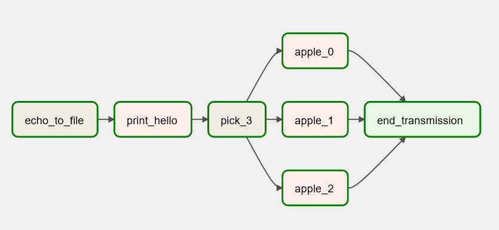

## DSA Airflow code review

###  Contributors:

- [Dylan Peterson](https://github.com/DyPeterson)

###  Description

A [Data Stack Academy](https://www.datastack.academy/) code review project to create a airflow DAG

###  Technologies Used:

- [Python](https://www.python.org/)
- [Apache Airflow](https://airflow.apache.org/)
####  Programs used:

- [Visual Code Studio](https://code.visualstudio.com/)

- [Windows Terminal](https://apps.microsoft.com/store/detail/windows-terminal/9N0DX20HK701?hl=en-us&gl=US) ( Running: [WSL2](https://docs.microsoft.com/en-us/windows/wsl/install) ([ubuntu 20.04](https://releases.ubuntu.com/20.04/)))

###  Setup & Installation:

1. Through the terminal like [GitBash](https://git-scm.com/downloads)

	2. Open the terminal and navigate to where you would like the new project to be using `cd` commands. Its also recommended that you make a new directory using `mkdir *directory-name*`.

	3. Clone the repository using the command `git clone https://github.com/DyPeterson/apache_cr.git`

	4. After cloning the directory it will appear in the directory that your terminal is set to. So make sure you are in the directory that you want this project copied to.

	5. Once this project is cloned you can navigate to that folder within your terminal and create a virtual environment `python3.7 -m venv *any-name*`. Now activate the venv with `source *any-name*/bin/activate`

	6. Install requirements in venv `pip install -r requirements.txt`

	7. `code .` to open in default coding software.

2. Through GitHub.com

	3. Go to the project's directory page **[HERE](https://github.com/DyPeterson/bigquery_cr.git)**

	4. Click the green `code` button to open the drop-down menu.

	5. At the bottom of the menu will have *Download Zip*. Go ahead and click it to download the project.

	6. Once downloaded find the `.zip` file and right-click it to bring up the menu. Within that menu click `Extract Here` to extract it in the current folder or click `Extract Files...`to select which folder you would like the project in.

	7. Once the project has been extracted, locate the folder in a terminal and open it with `code .` .

3. Download CSVs with either:

###  Useful Links

####  Link to project on GitHub:

[GitHub Repository](https://github.com/DyPeterson/bigquery_cr)

###  Details
This Apache Airflow DAG uses BashOperator to `echo "Dylan" > /opt/airflow/dags/ch6_code_review.txt` which writes my name to a .txt file(echo_to_file). It then uses a PythonOperator to print the contents of the .txt file with a greeting(print_hello). After that it runs 3 simultaneous tasks that print a random value from a list of apples(apple_0, apple_1, apple_2). From there it's final task is an EmptyOperator which does nothing but demonstrate the end of the DAG(end_transmission)

Contact me with any questions or suggestions [Here](dylan.peterson17@gmail.com)

###  Known Bugs

No known bugs at this time.

###  Copyright 2022

Permission is hereby granted, free of charge, to any person obtaining a copy of this software and associated documentation files (the "Software"), to deal in the Software without restriction, including without limitation the rights to use, copy, modify, merge, publish, distribute, sublicense, and/or sell copies of the Software, and to permit persons to whom the Software is furnished to do so, subject to the following conditions:

The above copyright notice and this permission notice shall be included in all copies or substantial portions of the Software.

THE SOFTWARE IS PROVIDED "AS IS", WITHOUT WARRANTY OF ANY KIND, EXPRESS OR IMPLIED, INCLUDING BUT NOT LIMITED TO THE WARRANTIES OF MERCHANTABILITY, FITNESS FOR A PARTICULAR PURPOSE AND NONINFRINGEMENT. IN NO EVENT SHALL THE AUTHORS OR COPYRIGHT HOLDERS BE LIABLE FOR ANY CLAIM, DAMAGES OR OTHER LIABILITY, WHETHER IN AN ACTION OF CONTRACT, TORT OR OTHERWISE, ARISING FROM, OUT OF OR IN CONNECTION WITH THE SOFTWARE OR THE USE OR OTHER DEALINGS IN THE SOFTWARE.